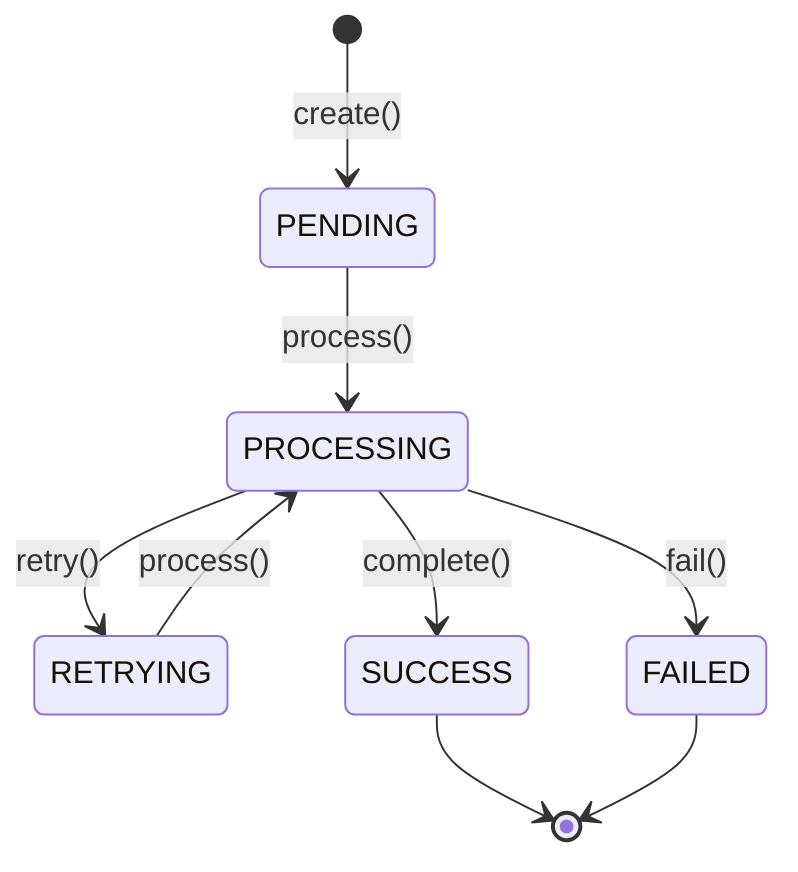

# 📢 Logistics Notification Service (알림 서비스)

스파르타 물류 시스템(Sparta Logistics System)의 슬랙(Slack) 메시지 및 알림 처리를 담당하는 마이크로서비스입니다.

---

## 🛠 주요 기술 스택

- **Core**: Java 17, Spring Boot 3.5.14
- **Persistence**: PostgreSQL, Spring Data JPA, QueryDSL 5.1.0
- **Messaging & Cache**: RabbitMQ (Spring AMQP), Redis (Spring Cache)
- **Client & Tracing**: OpenFeign, Micrometer Tracing (Zipkin)
- **API Docs**: Springdoc OpenAPI (Swagger UI)

---

## 🚀 핵심 기술적 강점 (Technical Highlights)

이 프로젝트는 단순한 기능 구현을 넘어, 엔터프라이즈 환경에서의 안정성과 확장성을 고려하여 설계되었습니다.

1. **헥사고날 아키텍처 (Hexagonal Architecture)**
   - 도메인 로직을 외부 인프라(DB, 외부 API, 메시지 브로커)로부터 완전히 격리하여, 비즈니스 규칙의 변경이 인프라에 영향을 주지 않도록 설계했습니다.
   - `Application` 계층과 `Domain` 계층의 명확한 분리를 통해 테스트 용이성과 유지보수성을 극대화했습니다.

2. **이벤트 기반 아키텍처 (Event-Driven Architecture)**
   - `RabbitMQ`를 활용한 비동기 메시지 처리를 통해 시스템 간 결합도를 낮추고, 트래픽 급증 시에도 안정적인 서비스 처리가 가능하도록 설계했습니다.
   - `EventEnvelope`를 통한 표준화된 이벤트 포맷을 사용하여 이벤트 추적성을 확보했습니다.

3. **동시성 제어 및 데이터 무결성**
   - JPA의 `@Version`을 활용한 **낙관적 락(Optimistic Lock)**을 적용하여, 분산 환경에서의 데이터 수정 충돌을 방지하고 무결성을 보장합니다.
   - 상태 전이 규칙(State Machine)을 도메인 모델에 내재화하여, 비즈니스적으로 유효하지 않은 상태 변경을 원천 차단합니다.

4. **관측 가능성 (Observability)**
   - `Micrometer Tracing`과 `Zipkin`을 연동하여, 분산 환경에서의 요청 흐름을 추적하고 장애 발생 시 신속한 원인 파악이 가능하도록 구성했습니다.

---

## 📁 프로젝트 패키지 구조

헥사고날/클린 아키텍처 원칙에 따라 도메인 중심의 계층 분리를 준수합니다.

```text
src/main/java/com/sparta/logistics/notification
├── application/       # 비즈니스 유스케이스 / 애플리케이션 서비스 로직
├── common/            # 공통 예외(ApiException), 공통 코드(ErrorResponseCode, GeneralResponseCode)
├── domain/            # 순수 도메인 엔티티(SlackMessage), Value Objects(SlackMessageStatus, AuditInfo)
├── infrastructure/    # JPA Persistence(SlackMessageJpaEntity), RabbitMQ, Feign, Redis 구현체
└── presentation/      # REST Controller, Request/Response DTO, GlobalExceptionHandler
```

---

## 🚀 핵심 기능

### 1. AI 기반 메시지 생성 (AI ChatClient)
- `AiPromptClient`를 통해 외부 AI 모델과 연동하여 상황에 맞는 알림 메시지를 자동으로 생성합니다.
- 추상화된 인터페이스를 통해 AI 모델 변경 시에도 비즈니스 로직의 수정 없이 유연하게 대응 가능합니다.

### 2. 이벤트 기반 비동기 처리
- **비동기 메시지 발송**: `RabbitMQ`를 활용하여 슬랙 메시지 발송 요청을 비동기로 처리합니다.
- `TransmitSlackMessageEventProducer`를 통해 메시지 발송 이벤트를 발행하고, 이를 소비하여 실제 슬랙 API를 호출함으로써 시스템의 응답성을 높이고 결합도를 낮췄습니다.

---

## 🗄️ 데이터베이스 테이블 명세 (Database Schema)

### `p_slack_messages` (슬랙 메시지 발송 이력 테이블)

| 컬럼명 | 데이터 타입 | Nullable | PK / Key / Default | 설명 |
| :--- | :--- | :--- | :--- | :--- |
| `id` | `UUID` | **NOT NULL** | **PK** | 슬랙 메시지 기본키 (UUID) |
| `receiver_id` | `UUID` | **NOT NULL** | - | 수신자 ID |
| `sender_id` | `UUID` | **NOT NULL** | - | 발신자/요청자 ID |
| `content` | `VARCHAR(1024)` | **NOT NULL** | - | 슬랙 메시지 본문 내용 |
| `status` | `VARCHAR(24)` | **NOT NULL** | DEFAULT `'PENDING'` | 메시지 상태 (`PENDING`, `PROCESSING`, `SUCCESS`, `FAILED`, `RETRYING`) |
| `retry_count` | `INTEGER` | **NOT NULL** | DEFAULT `0` | 발송 재시도 횟수 |
| `error_message` | `VARCHAR(128)` | NULL | - | 발송 실패 시 예외 메시지 |
| `version` | `BIGINT` | NULL | `@Version` | 낙관적 락(Optimistic Lock) 버저닝 컬럼 |
| `created_at` | `TIMESTAMP` | **NOT NULL** | `@CreatedDate` | 레코드 생성 일시 |
| `created_by` | `UUID` | NULL | `@CreatedBy` | 레코드 생성자 ID |
| `updated_at` | `TIMESTAMP` | NULL | `@LastModifiedDate` | 레코드 수정 일시 |
| `updated_by` | `UUID` | NULL | `@LastModifiedBy` | 레코드 수정자 ID |
| `deleted_at` | `TIMESTAMP` | NULL | - | 논리 삭제 일시 (Soft Delete) |
| `deleted_by` | `UUID` | NULL | - | 논리 삭제 처리자 ID |

---

## 🔄 SlackMessage 도메인 생명주기 및 상태 전이 규칙

`SlackMessage` 도메인은 **Record 기반 불변 엔티티**로 작성되어 있으며, 분산 환경에서의 **멱등성(Idempotency) 보장 및 중복 발송 차단**을 위해 `PROCESSING` 락 상태를 보유합니다.



- **PENDING**: 알림 메시지 생성 완료 및 발송 대기 상태
- **PROCESSING**: 전송 진행 중 상태 (중복 발송 방지 및 멱등성 락 역할)
- **RETRYING**: 전송 실패 후 재시도 대기 상태 (재시도 횟수 `retryCount` 1 증가)
- **SUCCESS**: 알림 발송 최종 성공 상태 (종결 상태)
- **FAILED**: 최대 재시도 횟수 소진 등으로 인한 최종 발송 실패 상태 (종결 상태)

---

## 🚀 실행 및 API 문서

### 애플리케이션 실행
```bash
./gradlew bootRun
```

### Swagger API 문서
애플리케이션 실행 후 접속 URL:
- **Swagger UI**: `http://localhost:8080/api/api-docs`
- **OpenAPI Spec**: `http://localhost:8080/api/api-spec`
