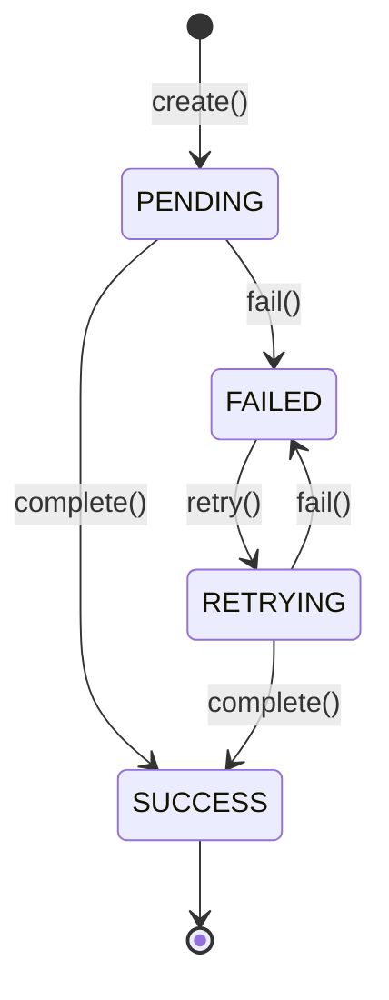

# 📢 Logistics Notification Service (알림 서비스)

스파르타 물류 시스템(Sparta Logistics System)의 슬랙(Slack) 메시지 및 알림 처리를 담당하는 마이크로서비스입니다.

---

## 🛠 주요 기술 스택

- **Core**: Java 17, Spring Boot 3.5.14
- **Persistence**: PostgreSQL, Spring Data JPA, QueryDSL 5.1.0
- **Messaging & Cache**: RabbitMQ (Spring AMQP), Redis (Spring Cache)
- **Client & Tracing**: OpenFeign, Micrometer Tracing (Zipkin)
- **API Docs**: Springdoc OpenAPI (Swagger UI)

---

## 📁 프로젝트 패키지 구조

헥사고날/클린 아키텍처 원칙에 따라 도메인 중심의 계층 분리를 준수합니다.

```text
src/main/java/com/sparta/logistics/notification
├── application/       # 비즈니스 유스케이스 / 애플리케이션 서비스 로직
├── common/            # 공통 예외(ApiException), 공통 코드(ErrorResponseCode, GeneralResponseCode)
├── domain/            # 순수 도메인 엔티티(SlackMessage), Value Objects(SlackMessageStatus, AuditInfo)
├── infrastructure/    # JPA Persistence(SlackMessageJpaEntity), RabbitMQ, Feign, Redis 구현체
└── presentation/      # REST Controller, Request/Response DTO, GlobalExceptionHandler
```

---

## 🗄️ 데이터베이스 테이블 명세 (Database Schema)

### `p_slack_messages` (슬랙 메시지 발송 이력 테이블)

| 컬럼명 | 데이터 타입 | Nullable | PK / Key / Default | 설명 |
| :--- | :--- | :--- | :--- | :--- |
| `id` | `UUID` | **NOT NULL** | **PK** | 슬랙 메시지 기본키 (UUID) |
| `receiver_id` | `UUID` | **NOT NULL** | - | 수신자 ID |
| `sender_id` | `UUID` | **NOT NULL** | - | 발신자/요청자 ID |
| `content` | `VARCHAR(1024)` | **NOT NULL** | - | 슬랙 메시지 본문 내용 |
| `status` | `VARCHAR(24)` | **NOT NULL** | DEFAULT `'PENDING'` | 메시지 상태 (`PENDING`, `SUCCESS`, `FAILED`, `RETRYING`) |
| `retry_count` | `INTEGER` | **NOT NULL** | DEFAULT `0` | 발송 재시도 횟수 |
| `error_message` | `VARCHAR(128)` | NULL | - | 발송 실패 시 예외 메시지 |
| `version` | `BIGINT` | NULL | `@Version` | 낙관적 락(Optimistic Lock) 버저닝 컬럼 |
| `created_at` | `TIMESTAMP` | **NOT NULL** | `@CreatedDate` | 레코드 생성 일시 |
| `created_by` | `UUID` | NULL | `@CreatedBy` | 레코드 생성자 ID |
| `updated_at` | `TIMESTAMP` | NULL | `@LastModifiedDate` | 레코드 수정 일시 |
| `updated_by` | `UUID` | NULL | `@LastModifiedBy` | 레코드 수정자 ID |
| `deleted_at` | `TIMESTAMP` | NULL | - | 논리 삭제 일시 (Soft Delete) |
| `deleted_by` | `UUID` | NULL | - | 논리 삭제 처리자 ID |

---

## 🔄 SlackMessage 도메인 생명주기 및 상태 전이 규칙

`SlackMessage` 도메인은 **Record 기반 불변 엔티티**로 작성되어 있으며, 상태 변경 시 자율적인 유효성 검증과 함께 새로운 불변 객체를 반환합니다.



- **PENDING**: 알림 생성 완료 및 발송 대기 상태
- **RETRYING**: 발송 실패 후 재시도 중인 상태 (재시도 횟수 `retryCount` 1 증가)
- **SUCCESS**: 알림 발송 최종 성공 상태
- **FAILED**: 알림 발송 최종 실패 상태

---

## 🛡️ 동시성 제어 및 영속성 매핑

- **낙관적 락(Optimistic Lock)**: `SlackMessageJpaEntity`에 `@Version` 필드를 적용하여 워커 간 동시 수정 충돌을 방지합니다.
- **도메인 격리**: JPA 엔티티와 순수 도메인 모델 간 `createFromModel`, `updateFromModel`, `toModel`을 통한 명확한 매핑을 지원합니다.

---

## 🚀 실행 및 API 문서

### 애플리케이션 실행
```bash
./gradlew bootRun
```

### Swagger API 문서
애플리케이션 실행 후 접속 URL:
- **Swagger UI**: `http://localhost:8080/api/api-docs`
- **OpenAPI Spec**: `http://localhost:8080/api/api-spec`

